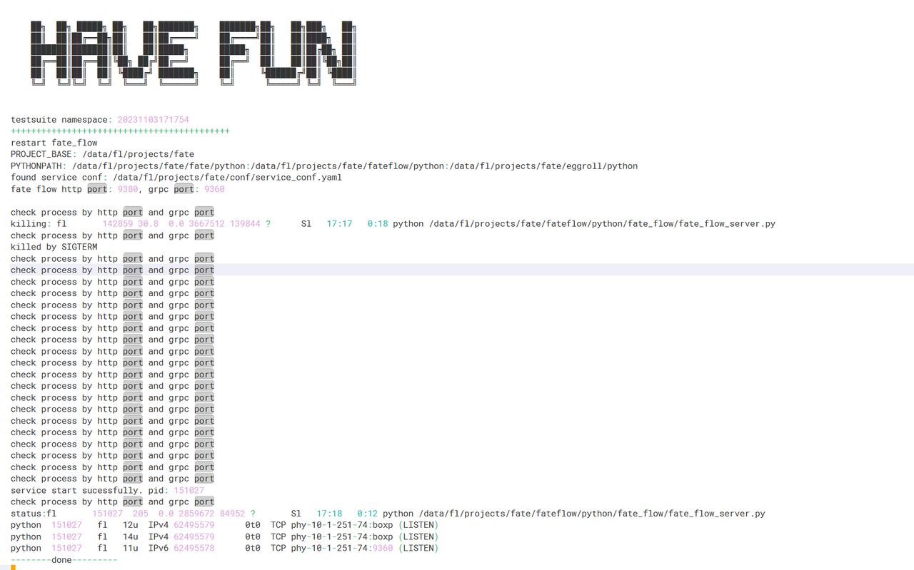

### Fate如何快速在ARM服务器上运行？
> 本文档仅针对使用allinone方式部署的Fate，如何快速在ARM服务器进行部署，运行。

#### 1. 环境准备
准备一个x86的服务器（Ubuntu/CentOS），一个ARM服务器（Kylin Phytium）。

#### 2. 介质准备
#### 2.1 x86服务器
- 在x86服务器上下载allinone部署包(https://webank-ai-1251170195.cos.ap-guangzhou.myqcloud.com/fate/1.9.2/release/fate_cluster_install_1.9.2_release.tar.gz)


- 根据文档部署allinone的Fate，只要安装一方（https://github.com/FederatedAI/FATE/blob/master/deploy/cluster-deploy/doc/fate_on_eggroll/fate-allinone_deployment_guide.zh.md ）

具体安装过程如下（如果有现成的可以跳过）

1. 解压
```shell
tar zxvf fate_cluster_install_1.9.2_release.tar.gz
```

2. 修改配置
```shell
cd fate_cluster_install_1.9.2_release/allInone/conf
vim setup.conf
```

> 具体配置参考官方文档
3. 安装
```shell
cd ..
./deploy.sh
```


4. 查看安装日志
```shell
tail -f logs/deploy-guest.log
```

> 安装需要一段时间，安装完成后，可以看到如下日志


5. 停止服务
```shell
cd /data/fl/projects/fate
cd eggroll/bin
./eggroll.sh clustermanager stop
./eggroll.sh nodemanager stop
./eggroll.sh rollsite stop
```


```shell
cd /data/fl/projects/fate/fateflow/bin
bash service.sh stop
```

```shell
cd /data/fl/projects/fate/fateboard
bash service.sh stop
```

```shell
cd /data/fl/projects/fate/common/mysql/mysql-8.0.28
bash service.sh stop
```

6. 打包文件
```shell
cd /data/fl/projects
tar -zxvf fate.tar.gz fate
```
> 打包前建议将测试的数据删除，以及common中的依赖删除


#### 2.2 ARM服务器

1. 安装操作系统依赖
```shell
yum -y install gcc gcc-c++ make openssl-devel gmp-devel mpfr-devel libmpc-devel libaio numactl autoconf automake libtool libffi-devel snappy snappy-devel zlib zlib-devel bzip2 bzip2-devel lz4-devel libasan lsof
```
2. 安装jdk
- 准备ARM版本的jdk（https://dragonwell-jdk.io/#/index）
```shell
mkdir common
cd common
wget https://github.com/dragonwell-project/dragonwell8/releases/download/dragonwell-extended-8.16.17_jdk8u382-ga/Alibaba_Dragonwell_Extended_8.16.17_aarch64_linux.tar.gz
```

- 安装
```shell
tar zxvf Alibaba_Dragonwell_Extended_8.16.17_aarch64_linux.tar.gz
```
- 配置环境变量
```shell
export JAVA_HOME=/data/fltest/common/dragonwell-8.16.17
export CLASSPATH=.:$JAVA_HOME/lib/dt.jar:$JAVA_HOME/lib/tools.jar
export PATH=$PATH:$JAVA_HOME/bin
```

3. 安装Python3.8
- 下载Python3.8安装包（https://www.python.org/）
```shell
tar zxvf Python-3.8.16.tgz
cd Python-3.8.16
./configure --prefix=/data/fltest/common/python38
make && make install
```
- 创建venv
```shell
cd ~/common
./python38/bin/python3.8 -m venv venv
```

4. 准备一个Mysql库
```shell
create database fate_flow_arm character set utf8 collate utf8_bin;
create database eggroll_meta_arm character set utf8 collate utf8_bin;
create user 'fed'@'%' identified by '*******';
grant all privileges on *.* to fed@'%'; 
```

> 需要初始化errgroll_meta_arm库，初始化server_node表。相关sql文件可以在mysql安装的目录sql目录下.


#### 3. ARM服务器部署
> 将从x86服务器打的包上传到ARM服务器。

3.1 安装Python依赖
```shell
source common/venv/bin/activate
cd soft
pip3.8 install -r requirement.txt -i https://pypi.tuna.tsinghua.edu.cn/simple
```


[requirement.txt](files/requirement.txt)

3.2 修改配置
```shell
mkdir projects
tar -xzvf fate.tar.gz -C projects/
```

```shell
cd projects/fate/bin
vim init_env.sh
```
> 将文件中的相关目录改为实际在arm服务器中的目录

```shell
cd projects/fate/conf
vim service_conf.yaml
```
> 修改数据库相关信息，以及fatelfow、fateboard的端口号
```shell
cd projects/fate/eggroll/conf
vim eggroll.properties
```
> 修改数据库相关信息，nodemanager、rollsite端口号，jdk路径，python路径等
```shell
vim route_table.json 
```
> 修改party的信息，将之前在x86服务器的地址换成arm服务器的地址
```shell
cd projects/fate/fateboard
vim conf/application.properties 
```
> 修改fateflow的端口号，board的端口号

3.3 启动
```shell
cd project/fate
source bin/init_env.sh 
cd eggroll/bin
./eggroll.sh clustermanager start
./eggroll.sh nodemanager start
./eggroll.sh rollsite start

cd ../fateflow/bin
bash service.sh start

cd ../../fateboard/
bash service.sh start
```


> fateflow在启动的时候需要在${project}/fateflow/bin/service.sh中增加export LD_PRELOAD=$pyenv/lib/python3.8/site-packages/sklearn/__check_build/../../scikit_learn.libs/libgomp-d22c30c5.so.1.0.0

3.4 验证
```shell
pip3.8 install fate-client==1.9.0 -i https://pypi.douban.com/simple
flow init --ip=127.0.0.1 --port=49380
flow test toy -hid 9999 -gid 9999
```
